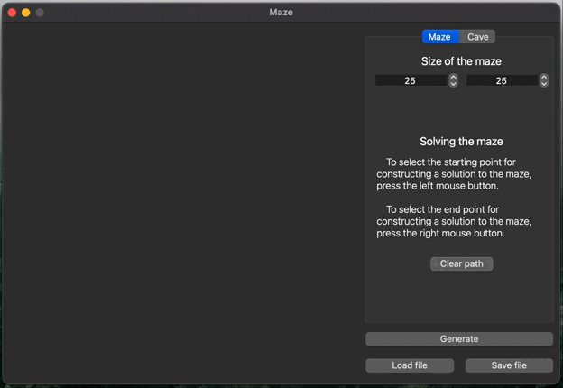

# Maze

Implementation of the Maze project.

## Introduction

In this project you’ll learn about mazes and caves, including the basic algorithms of their handling, such as: generation, rendering, solving.

## Installation
      make install

## Uninstallation
      make uninstall

## Eller's Algorithm

Eller's algorithm creates 'perfect' mazes, having only a single path between any two cells, one row at a time. The algorithm itself is incredibly fast, and far more memory efficient than other popular algorithms (such as Prim's and Kruskal's) requiring storage proportional to only a single row. This makes it possible to create mazes of indefinite length on systems with limited memory.

Update:At least one new useful page has appeared on the net since I first wrote this. Check out Jamis Buck'sMaze Generation: Eller's Algorithm blog post. I'll add other useful links as I find them.

##### The Algorithm

 1. Create the first row. No cells will be members of any set

 2. Join any cells not members of a set to their own unique set

 3. Create right-walls, moving from left to right:
    - Randomly decide to add a wall or not
      - If the current cell and the cell to the right are members of the same set, always create a wall between them. (This prevents loops)
      - If you decide not to add a wall, union the sets to which the current cell and the cell to the right are members.

 4. Create bottom-walls, moving from left to right:
    - Randomly decide to add a wall or not. Make sure that each set has at least one cell without a bottom-wall (This prevents isolations)
      - If a cell is the only member of its set, do not create a bottom-wall
      - If a cell is the only member of its set without a bottom-wall, do not create a bottom-wall

 5. Decide to keep adding rows, or stop and complete the maze
    - If you decide to add another row:
      - Output the current row
      - Remove all right walls
      - Remove cells with a bottom-wall from their set
      - Remove all bottom walls
      - Continue from Step 2

    - If you decide to complete the maze
      - Add a bottom wall to every cell
      - Moving from left to right:
          - If the current cell and the cell to the right are members of a different set:
              - Remove the right wall
              - Union the sets to which the current cell and cell to the right are members.
              - Output the final row

## Generation using a cellular automaton

In many games there is a need for branching locations, such as caves.
They can be created by generation using the cellular automaton.
This kind of generation uses an idea similar to the Game of Life you are already familiar with. The idea of the proposed algorithm consists of implementing only two steps: first, the whole field is filled randomly with walls - i.e., for each cell it is randomly determined whether it will be free or impassable - and then the map state is updated several times according to the conditions, similar to the birth/death ones in the Game of Life.

The rules are simpler than in the Game of Life - there are two special variables, one for "birth" of "dead" cells (the "birth" limit) and one for destruction of "live" cells (the "death" limit).
If "live" cells are surrounded by "live" cells, the number of which is less than the "death" limit, they "die". In the same way, if "dead" cells are next to "live" cells, the number of which is greater than the "birth" limit, they become "live".

## Part 1. Implementation of the Maze project

You need to implement a Maze program that can generate and render perfect mazes and caves:
- The program must be developed in C++ language of C++17 standard
- The program code must be located in the src folder
- When writing code it is necessary to follow the Google style
- The program must be built with Makefile which contains standard set of targets for GNU-programs: all, install, uninstall, clean, dvi, dist, tests. Installation directory could be arbitrary, except the building one
- GUI implementation, based on any GUI library with API for C++17: Qt
- The program has a button to load the maze from a file
- Maximum size of the maze is 50x50
- The loaded maze must be rendered on the screen in a field of 500 x 500 pixels
- "Wall" thickness is 2 pixels
- The size of the maze cells themselves is calculated so that the maze occupies the entire field allotted to it.

## Part 2. Generation of a perfect maze

Add the ability to automatically generate a perfect maze. \
A maze is considered perfect if it is possible to get from each point to any other point in exactly one way.
- You must generate the maze according to [Eller's algorithm](#ellers-algorithm):
- The generated maze must not have isolations and loops
- Prepare full coverage of the perfect maze generation module with unit-tests
- The user enters only the dimensionality of the maze: the number of rows and columns
- The generated maze must be saved in the file
- The created maze should be displayed on the screen

## Part 3. Solving the maze

Add the ability to show the solution to _any_ maze currently shown on the screen:
- The user sets the starting and ending points
- The route, which is the solution, must be displayed with a line 2 pixel thick, passing through the middle of all the cells in the maze through which the solution runs.
- The color of the solution line must be different from the color of the walls, and the field
- Prepare full coverage of the maze solving module with unit-tests

## Part 4. Bonus. Cave Generation

Add cave generation [using a cellular automaton](#generation-using-a-cellular-automaton):
- The user selects the file that describes the cave
- Use a separate window or tab in the user interface to display the caves
- Maximum size of the cave is 50 x 50
- The loaded cave must be rendered on the screen in a field of 500 x 500 pixels
- The user sets the limits for "birth" and "death" of a cell, as well as the chance for the starting initialization of the cell
- The "birth" and "death" limits can have values from 0 to 7
- Cells outside the cave are considered alive
- There should be a step-by-step mode for rendering the results of the algorithm in two variants:
    - Pressing the next step button will lead to rendering the next iteration of the algorithm
    - Pressing the automatic work button starts rendering iterations of the algorithm with a frequency of 1 step in `N` milliseconds, where the number of milliseconds `N` is set through a special field in the user interface
- The size of cells in pixels is calculated so that the cave occupies the entire field allotted to it
- Prepare full coverage of the cave generation module with unit-tests
